Apodotiko
================================
Apodotiko is a novel asynchronous training strategy designed for serverless FL. It incorporates a scoring mechanism that evaluates each client's hardware capacity and dataset size to intelligently prioritize and select clients for each FL training round, thereby minimizing the effects of stragglers on system performance. Our experiments results with Apodotiko demonstrate that it outperforms other FL training strategies, achieving an average speedup of 2.75x and a maximum speedup of 7.03x. Furthermore, Apodotiko strategy significantly reduces cold starts by a factor of four on average, demonstrating suitability in serverless environments.

## Scoring Clients in Apodotiko
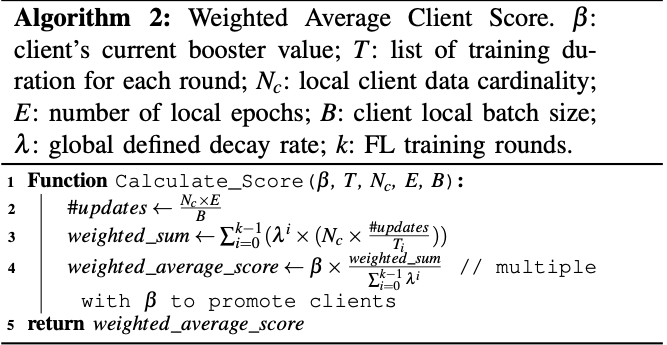

To score clients, we collect five attributes during each training round: training duration, local client data cardinality, batch size, number of local epochs, and a booster value. Training duration represents the time required for executing model.fit(), excluding the time spent on network communication and model initialization. The booster value is a floating point number used in our strategy for promoting fairness during client scoring and selection. Algortihm 2 describes our strategy for scoring clients. It generates a weighted average score by considering a client’s participation in the different FL training rounds.

## Asynchronous aggregation in Apodotiko
The FedLess controller supports aggregation of client model updates asynchronously without waiting for all current client model updates to be available in the MongoDB database. This value can be modified using the concurrency ratio parameter in the FedLess [controller](./fedless/controller/scripts.py).

## Experiment Results

### Comparing Accuracy (Synchronous and Semi-asynchronous)
The below figures demonstrate the convergence speeed of Apodotiko compared to other baseline strategies for different datasets.

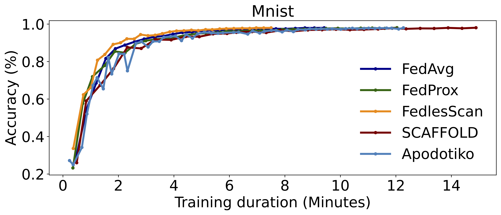
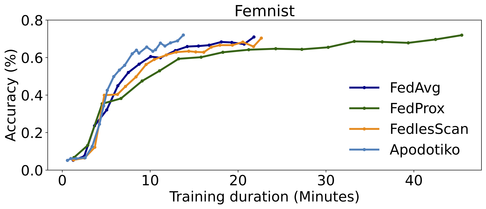
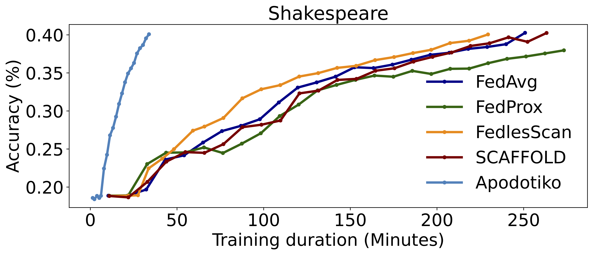
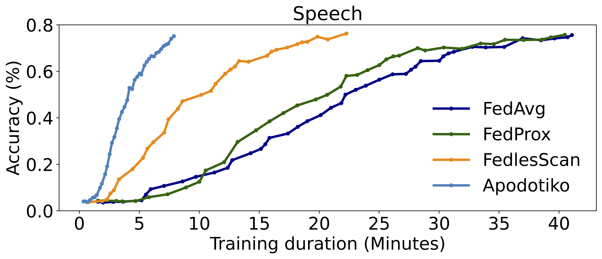

### Comparing Accuracy (Asynchronous)
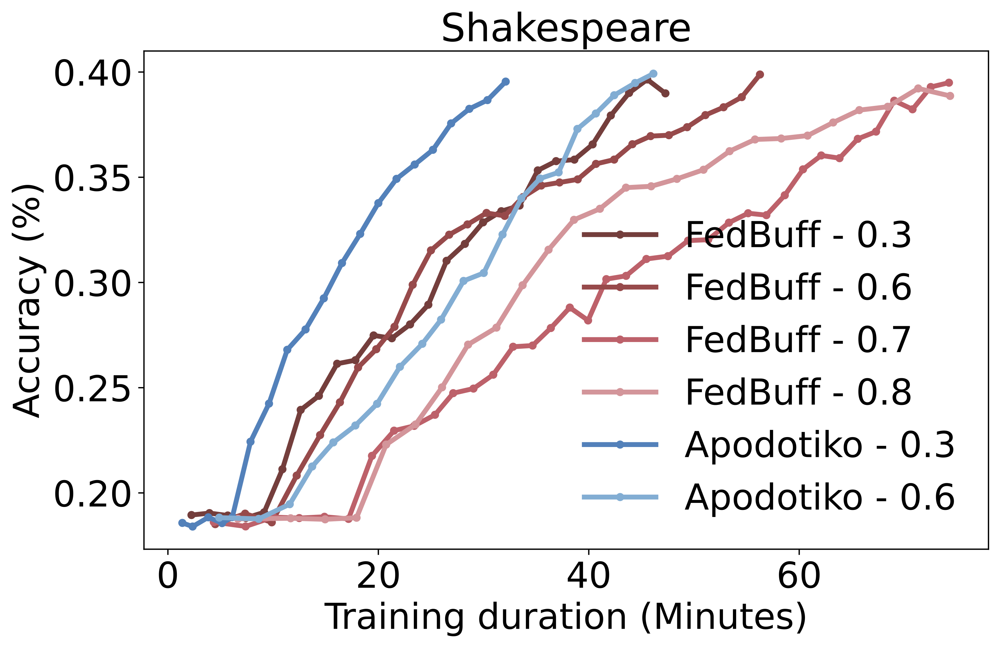
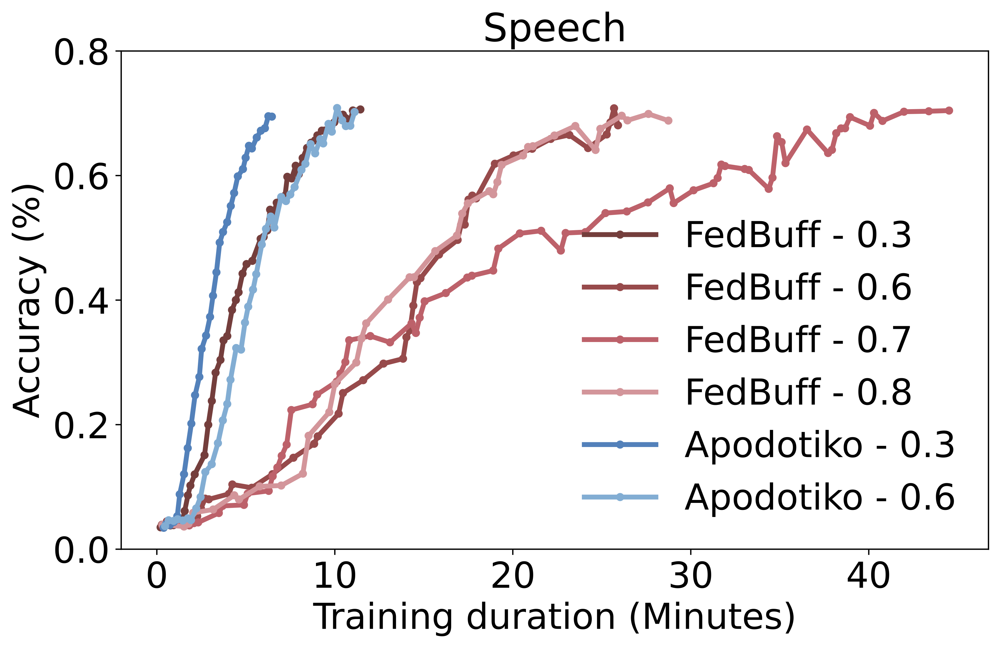

### Comparing Cold Start Ratios
The below figures demonstrate the cold start reductions achieved with Apodotiko compared to other baseline strategies for different datasets.

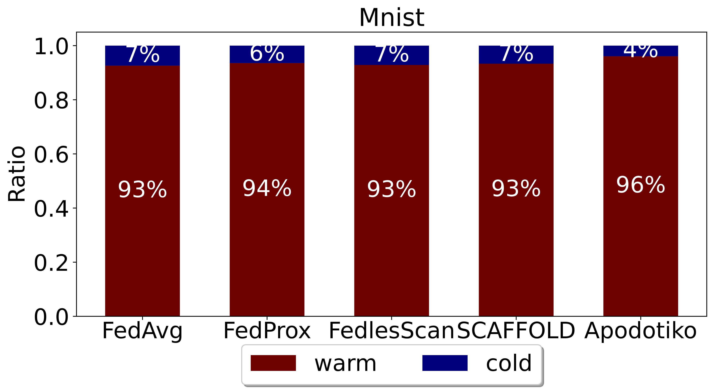
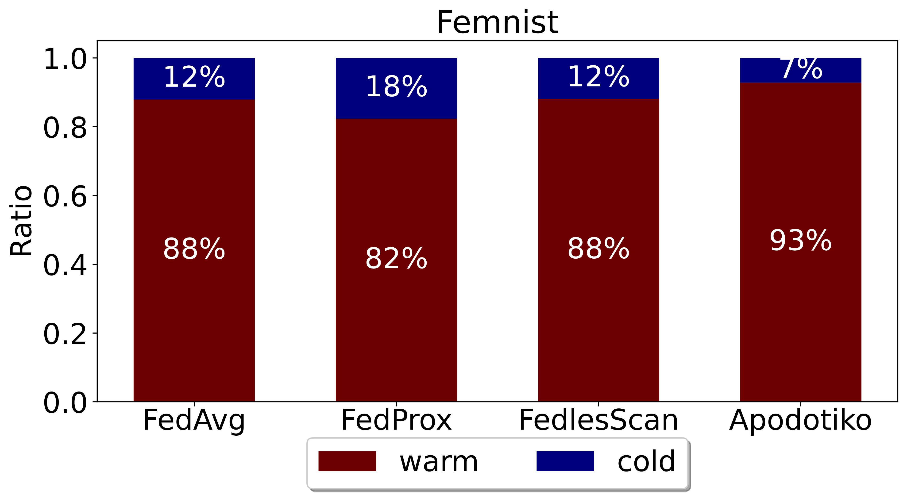
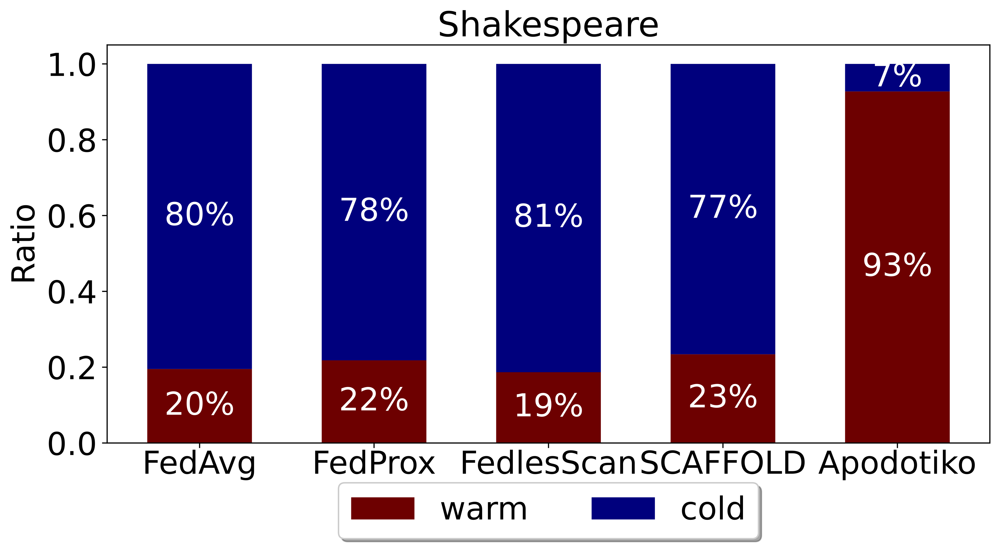
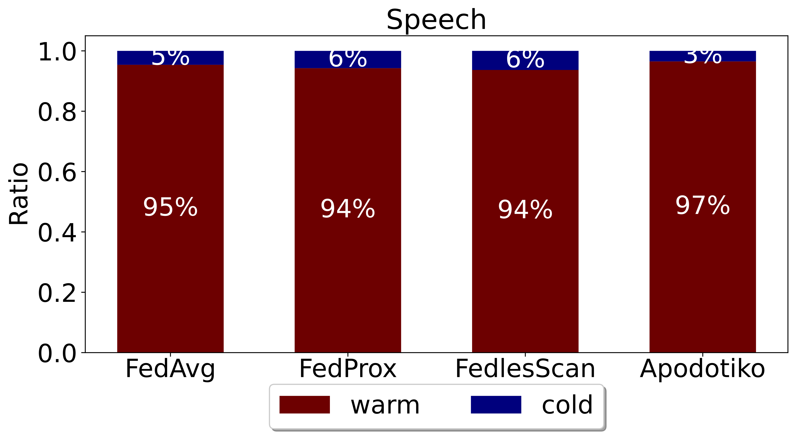

### Comparing Training Costs
Apodotiko demonstrates competetive cost efficiency compared to other FL training strategies.

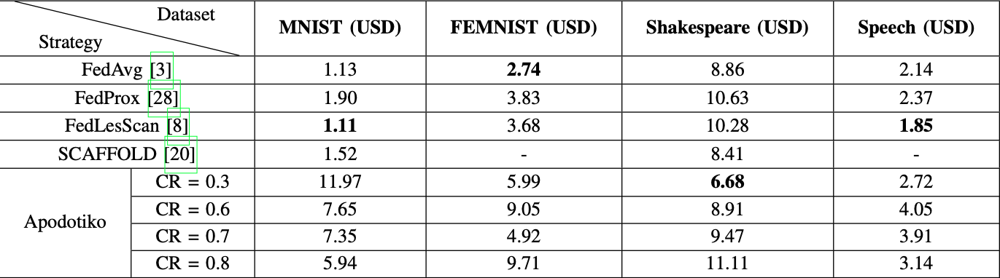