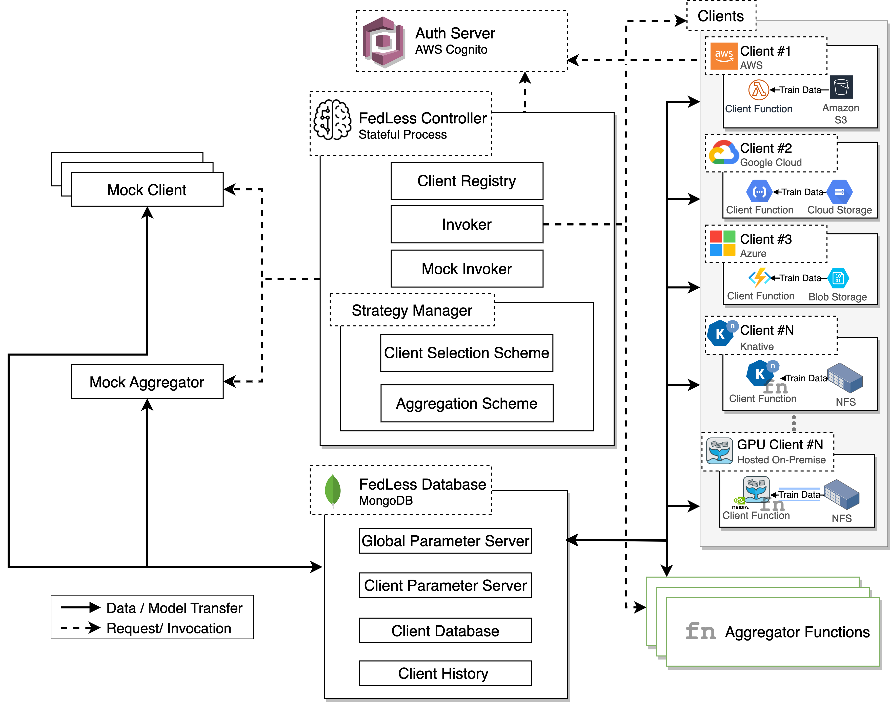
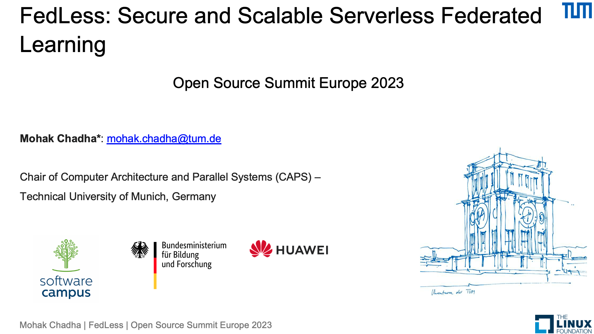

FedLess
================================
This is an extended version of our framework [FedLess](https://github.com/andreas-grafberger/fedless) with support for CPU and [GPU clients](./GPU-node.md) along with multiple FL training strategies such as FedAvg, [FedProx](https://proceedings.mlsys.org/paper_files/paper/2020/hash/1f5fe83998a09396ebe6477d9475ba0c-Abstract.html), [Scaffold](https://proceedings.mlr.press/v119/karimireddy20a.html), [Fedbuff](https://proceedings.mlr.press/v151/nguyen22b.html), [FedLessScan](https://github.com/Serverless-Federated-Learning/FedLesScan), and [Apodotiko](./Apodotiko.md). 


# Architecture



The system design for FedLess is shown above. It contains the following components:

1- **Authentication server**: handles the authentication of the clients.

2- **FedLess Database**: contains info about clients and act as a central parameter and log server.

3- **FedLess Controller**: python process that runs and coordinates the training.

4- **Clients**: serverless functions that perform local training on the client side.

5- **Aggregator function**: aggregates the results from the clients after each round. These are also serverless functions.

6- **Mock client & aggregator**: components that runs locally to simulate the behavior of client & aggregator functions (for development purposes only).

## Installation

Requires Python 3.8 (other Python 3 version might work as well)

```bash
# (Optional) Create and activate virtual environment
virtualenv .venv
source .venv/bin/activate

# Install development dependencies
pip install ".[dev]"
```

## Development

Bash scripts are checked in CI via [ShellCheck](https://github.com/koalaman/shellcheck). For python tests and linting
use the commands below.

```bash
# Run tests
pytest

# Lint
black .
```

## Deployment

The system requires the deployment of a  **mongodb database** to be used as the parameter server. You also need to deploy **client, aggregator and evaluator** (optional) functions.

Various scripts require an installed and fully
configured [AWS Command Line Interface](https://aws.amazon.com/cli/?nc1=h_ls). Install and configure it if you want to
deploy functions or images with AWS.  
If possible, we configure and deploy functions (including AWS Lambda)
with the [Serverless Framework](https://www.serverless.com/framework/docs/getting-started/). When using Serverless with
AWS make sure you have everything set up according
to [this guide](https://www.serverless.com/framework/docs/providers/aws/guide/credentials/). You can also use [gFaaS](https://github.com/kky-fury/gFaaS) for function deployment.

```bash
# Install Serverless Framework (MacOS/Linux only)
curl -o- -L https://slss.io/install | bash
```


All functions are located in the [functions](./functions/) directory along with deplyoment *deploy.sh,* scripts. Fedless currently supports client functions on the following FaaS platforms:
    
1. [OpenFaaS](https://github.com/openfaas/faas)
2. [OpenWhisk](https://github.com/apache/openwhisk)
3. [Knative](https://github.com/knative/serving)
4. [Google Cloud Functions](https://cloud.google.com/functions?hl=en)
5. [AWS Lambda](https://aws.amazon.com/lambda/)
6. [Azure functions](https://azure.microsoft.com/en-us/products/functions)

Regarding the folder names in the [functions](./functions/) directory: *client* refers to [FedKeeper](https://github.com/ansjin/fl_faas_fabric) clients **[deprecated]**, *client-indep* to FedLess clients and *client-indep-secure*
clients are FedLess functions with security enabled.

#### Note
Keep in mind that whenever we use a custom Docker image, you likely have to upload the Python wheel for FedLess to e.g., a custom s3 bucket and change the URL inside Dockerfiles or bash scripts to point to your new file on s3.
For these tasks, just look inside the [scripts](./scripts/) directory, where almost everything should already exist and only should need small adjustments (like changing the base path to your s3 bucket and so on).

### Workflow
1. Build FedLess after your changes
2. Upload the wheel to s3
3. Build a new Docker image (scripts for that also contained in [scripts](./scripts/) directory)
4. Deploy the function.

## Using FedLess

For this, you can, e.g., take a look at the bash scripts inside [experiments](./experiments/) folder.

You basically have to create a new YAML config file first with information about parameter server, aggregator and client functions.
Here we show a sample of the configuration file to run the experiment. Note that sensitive variables such as `db_username` can be fetched from your env directly and are not required to be specified in the config file.

```
database:
  host: "your db url"
  port: port
  username: db_username
  password: db_password

evaluator:
  params:
    type: openfaas
    url: http://138.246.234.228:31112/function/evaluator
  type: openfaas

aggregator:
  hyperparams:
    tolerance: 2 # specified for fedlesscan strategy only
  function:
    params:
      type: openfaas
      url: aggregator_url
    type: openfaas

clients:
  hyperparams:
    epochs: 2
    batch_size: 5
    optimizer:
      class_name: "Adam"
      config:
        name: "Adam"
        learning_rate: 0.001
    metrics:
      - accuracy
  functions:
    - function:
        params:
          type: openfaas
          url: function_url
        type: openfaas

```

There are already scripts in the [scripts](./scripts/deployment_scripts/) folder to deploy a parameter server in a Kubernetes cluster. The same is true for the file server.

#### With AWS Cognito Enabled
To run FedLess functions with enabled security, you basically have to create a custom Cognito user pool with the required app clients, but this is a bit more involved. An example can be found [here](./scripts/aws_cognito/).

### GPU clients

For GPU clients it requires extra configuaration on the client side. (especially for GPU sharing). This is described more in detail in a seperate [markdown](GPU-node.md). Gpu-based clients are curently supported only for OpenFaaS.

## CLI 

To run the platform run the entry to the controller module in **fedless.controller.scripts**

Run the help command to see the available cli parameters.

Options:
- -d, --dataset [mnist|femnist|shakespeare|speech]
                                  [required]
- -c, --config PATH               Config file with faas platform and client
                                  function information  [required]

- -s, --strategy [fedavg|fedlesscan|fedprox]
                                  [required]
- --clients INTEGER               number of clients  [required]
  --clients-in-round INTEGER      number of clients sampled per round
                                  [required]

- --stragglers INTEGER            number of allowed stragglers per round
-  --timeout FLOAT                 maximum wait time for functions to finish
-  --rounds INTEGER                maximum wait time for functions to finish
-  --max-accuracy FLOAT            stop training if this test accuracy is
                                  reached

-  -o, --out PATH                  directory where logs will be stored
                                  [required]

-  --tum-proxy / --no-tum-proxy    use in.tum.de proxy
-  --proxy-in-evaluator / --no-proxy-in-evaluator
                                  use proxy also in evaluation function
-  --mock / --no-mock              use mocks
-  --simulate-stragglers FLOAT     define a percentage of the straggling clients, this option overrides the
                                  invocation delay if specified in the
                                  function

- --buffer-ratio FLOAT            Ratio of clients to perform early aggregation (currently only works with *FedlesScore*)

  --help                          Show this message and exit.


### Talks:

This is a talk about FedLess at the OpenSource Summit Europe 2023.

[](https://youtu.be/fQ8sul-yHTA?si=13TZet5yGDC9ex3p)

A more detailed talk about FedLess can be found [here](https://youtu.be/qsAn5_P03k8).

### Publications
The following is the list of publications that utilize FedLess.

 1. Mohak Chadha, Anshul Jindal, and Michael Gerndt. "Towards Federated Learning Using FaaS Fabric." In 6th International Workshop on Serverless Computing in conjunction with ACM Middleware 2020. (WoSC@Middleware). 2020. [Link](https://www.ajindal.me/publication/fl_faas/fl_faas.pdf).
2. Andreas Grafberger, Mohak Chadha, Anshul Jindal, Jianfeng Gu, and Michael Gerndt. "FedLess: Secure and Scalable Federated Learning Using Serverless Computing". In 9th IEEE International Conference on Big Data (Big Data). 2021. [Link](https://arxiv.org/pdf/2111.03396.pdf).
3. Mohamed Elzohairy, Mohak Chadha, Anshul Jindal, Andreas Grafberger, Jianfeng Gu, Michael Gerndt, and Osama Abboud."FedLesScan: Mitigating Stragglers in Serverless Federated Learning". In 10th IEEE International Conference on Big Data (Big Data). 2022. [Link](https://arxiv.org/pdf/2211.05739.pdf).
4. Mohak Chadha, Pulkit Khera, Jianfeng Gu, Osama Abboud, and Michael Gerndt. "Training Heterogeneous Client Models using Knowledge Distillation in Serverless Federated Learning". In 39th ACM/SIGAPP Symposium on Applied Computing (SAC). 2024.

## Citation.
If you use FedLess in your work, please cite our paper:
```
@INPROCEEDINGS{fedless,  
    author={Grafberger, Andreas and Chadha, Mohak and Jindal Anshul and Gu, Jianfeng and Gerndt, Michael},  
    booktitle={2021 IEEE International Conference on Big Data (Big Data)},   
    title={FedLess: Secure and Scalable Federated Learning Using Serverless Computing},   
    year={2021},    
    pages={164-173},  
    url={https://doi.org/10.1109/BigData52589.2021.9672067}
}
```
## Contributors:

1. [Mohak Chadha](https://github.com/kky-fury)
2. [Alexander Jensen](https://github.com/Ajexsen)
3. [Mohamed Elzohairy](https://github.com/mohamedazab)
4. [Andreas Grafberger](https://github.com/andreas-grafberger)
5. [Anshul Jindal](https://github.com/ansjin)
6. [Pulkit Khera](https://github.com/pulkit97)