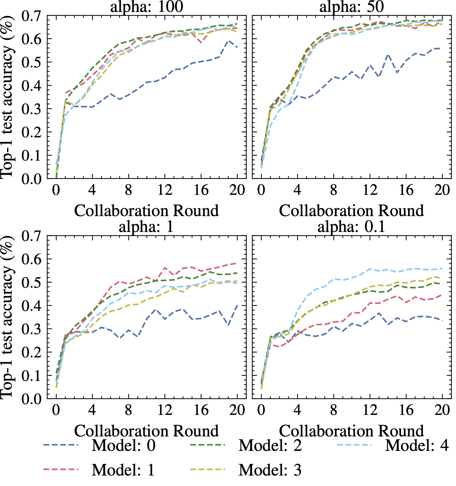

Training Heterogenous Personalized Client models with FedLess
================================
This is an extended version of our framework [FedLess](https://github.com/andreas-grafberger/fedless) with support for training heterogeneous personalized client models using serverless implmentations of the federated knowledge distillation algorithms [FedMD](https://arxiv.org/pdf/1910.03581.pdf) and [FedDF](https://proceedings.neurips.cc/paper_files/paper/2020/file/18df51b97ccd68128e994804f3eccc87-Paper.pdf).


## What is Knowledge Distillation?
Knowledge distillation is a popular technique used in ML that facilitates the transfer of knowledge
from a large and complex model, known as the teacher model, to a
smaller and more efficient model, referred to as the student model.

## Benefits of KD in FL?
When applied to FL, KD offers several advantages. These include model compression, heterogeneous and personalized client models, reduced communication overhead, and increased client privacy. Unlike traditional FL approaches that require exchanging the entire model parameters, most KD-based techniques typically only involve the transmission of class scores. This reduces the communication overhead and minimizes the data transferred between clients and the server during model aggregation. In addition, this prevents model inferencing attacks in FL.

## Serverless KD vs Conventional KD
The figure below highlights the advantages of using serverless computing for enabling KD in FL.


# Architecture


The system design for FedLess is shown above. It contains the following components:

1- **Authentication server**: handles the authentication of the clients.

2- **FedLess Database**: contains info about clients and act as a central parameter and log server.

3- **FedLess Controller**: python process that runs and coordinates the training.

4- **Clients**: serverless functions that perform local training on the client side.

5- **Aggregator function**: aggregates the results from the clients after each round. These are also serverless functions.

6- **Mock client & aggregator**: components that runs locally to simulate the behavior of client & aggregator functions (for development purposes only).

7- **Serverless Parallel Transfer Learning for FedMD**: We leverage [Ray](https://github.com/ray-project/ray) to enable faster and efficient transfer learning required in the initial stage of the FedMD algorithm.

### Deploying Ray with Kubernetes
The scripts for deployment can be found in the [scripts directory](./scripts/deployment_scripts/ray/).

## Serverless FedMD Workflow
The figure below describes the implementation of the FedMD algorithm using serverless computing in FedLess.


## Serverless FedDF Workflow
The figure below describes the implementation of the FedDF algorithm using serverless computing in FedLess.


## Experiment Results

### Heterogeneous Client Data Distribution
A major challenge in FL is the non-independent and identical (non-IID) data distribution among the participating clients. To analyze the behavior and robustness of the two serverless KD strategies toward different degrees of data heterogeneity, we used the Dirichlet distribution to create disjoint non-IID client training data partitions. A parameter $\alpha$ controls the degree of non-IID data distribution, where a smaller $\alpha$ value increases the probability of clients holding training samples from only one class and vice-versa.

The figures below show the data distributions we used in our experiments for varying values of $\alpha$ for the MNIST and CIFAR-10 datasets.

#### Serverless FedMD/FedDF MNIST


#### Serverless FedDF CIFAR


### Comparing Accuracy 
With our experiment results, we observed that FedDF demonstrates greater robustness to higher non-IID data distributions compared to FedMD as it maintains higher model accuracies even for lower values of $\alpha$. This can be attributed to two reasons. First, the usage of ensemble distillation in FedDF enhances the robustness of the global model to noise and outliers. Second, FedDF leverages unlabeled data in the distillation process, thereby enhancing its capacity to generalize to unseen data.

#### MNIST dataset

##### Serverless FedMD

##### Serverless FedDF


#### CIFAR 10/100 datasets

##### Serverless FedMD

##### Serverless FedDF


### Comparing Costs
In our experiments, we observed the FedDF was almost always more cost efficient than FedMD with savings up 82.7%.

<!-- ## Citation.
If you use serverless KD in your work, please cite our paper:
```
@INPROCEEDINGS{fedless,  
    author={Chadha, Mohak and Jindal Anshul and Gu, Jianfeng and Gerndt, Michael},  
    booktitle={2021 IEEE International Conference on Big Data (Big Data)},   
    title={FedLess: Secure and Scalable Federated Learning Using Serverless Computing},   
    year={2021},    
    pages={164-173},  
    url={https://doi.org/10.1109/BigData52589.2021.9672067}
}
``` -->
